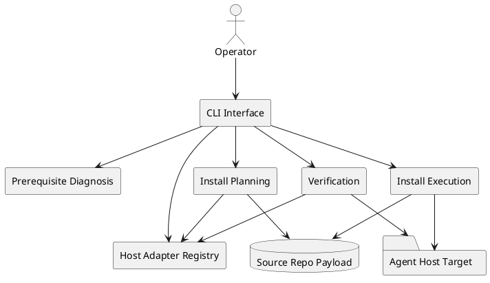
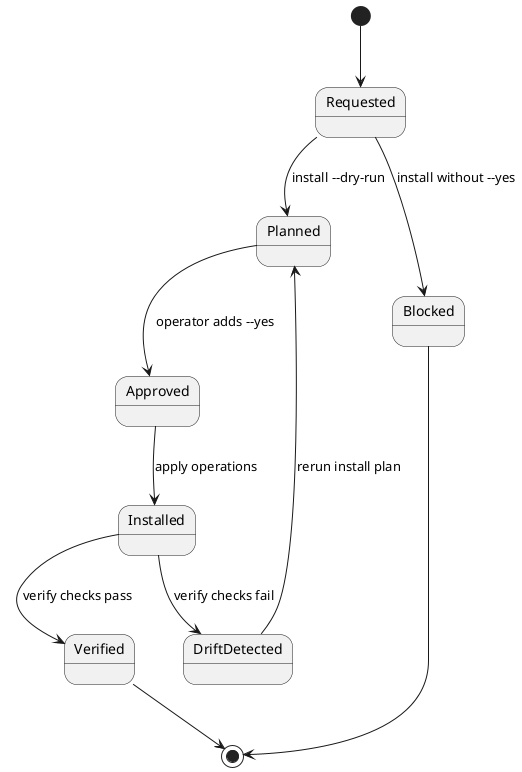
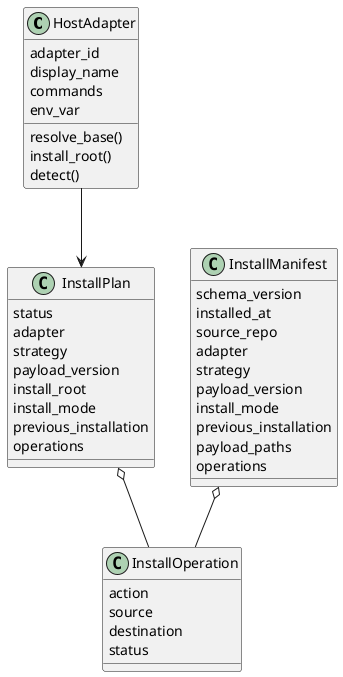

# Domain Analysis Pack

## Artifact Header

- Artifact ID: `DOM-002`
- Artifact type: `domain-analysis-pack`
- Title: `SynapseOS initialization and host installation domain`
- Status: `active`
- Owner: `Arthur`
- Canonical path: `.aries_harness/references/domain/DOM-002-synapseos-initialization-domain.md`
- Source of truth: `this file`
- Upstream links: `REQ-002`, `SPEC-002`, `STORY-002`, `ARCH-002`, `ADR-0004`
- Downstream links: `TRACE-001`, `AUDIT-001`, `init/`, `synapse-cli`, `tests/test_synapse_cli.py`
- Verification state: `implemented-baseline`
- Last reviewed: `2026-05-21`
- Refresh trigger: `synapse-cli command, adapter, prerequisite, install-plan, or verification contract changes`

## Evidence Corpus

| Evidence | Type | Scope |
| --- | --- | --- |
| `.aries_harness/references/specs/SPEC-002-synapseos-initialization-layer.md` | explicit requirement | CLI contract, safety rules, host list, acceptance conditions |
| `.aries_harness/decisions/architecture/ARCH-002-synapseos-initialization-layer.md` | design decision | component boundaries, adapter contract, evidence surfaces |
| `init/SKILL.md` | current behavior | initialization layer responsibilities and safety rules |
| `init/synapse_cli/*.py` | current behavior | parser, adapters, prerequisite checks, install plan/apply, verification |
| `synapse-cli` | current behavior | local executable entrypoint |
| `tests/test_synapse_cli.py` | executable evidence | parser, JSON, adapter matrix install, update refresh, conflict blocking, verification |

Out of scope for this domain pass: external package publishing, network install, automatic system package installation, uninstall, rollback, and deep host-specific smoke checks.

## Domain Language

| Term | Meaning | Source |
| --- | --- | --- |
| Initialization layer | First-run setup layer that prepares SynapseOS for local or host consumption | `SPEC-002`, `ARCH-002`, `init/SKILL.md` |
| Agent host adapter | Isolated host-specific target resolution and detection contract | `SPEC-002`, `adapters.py` |
| Generic adapter | Explicit-target adapter for non-standard hosts | `SPEC-002`, `adapters.py` |
| Runtime prerequisite | Required or optional local condition checked before install | `SPEC-002`, `prerequisites.py` |
| Install plan | Reviewable list of filesystem operations before external writes | `SPEC-002`, `installer.py` |
| Previous installation state | Structured evidence that the target is fresh, updateable, current, or unsafe before writes | `installer.py` |
| Install manifest | Post-apply evidence record written into the install root | `SPEC-002`, `installer.py` |
| Verification report | Read-only check result proving required entrypoints and manifest are present | `SPEC-002`, `installer.py` |
| Payload path | Source repo file or directory copied or symlinked into a host target | `installer.py` |

## Bounded Context Canvas

| Bounded context | Responsibility | Key model | Upstream | Downstream |
| --- | --- | --- | --- | --- |
| CLI Interface | Parse commands, options, output mode, and exit codes | Command, ResultEnvelope | operator request | all application services |
| Prerequisite Diagnosis | Inspect Python, Git, repo shape, permissions, and host detection | PrerequisiteCheck, HostDetection | local runtime | doctor output |
| Host Adapter Registry | Resolve adapter ids, default targets, env overrides, and explicit target policy | HostAdapter, DetectionResult | CLI Interface | Install Planning, Verification |
| Install Planning | Build deterministic operations without applying writes | InstallPlan, InstallOperation, PayloadPath | adapter plus source repo | install dry-run or executor |
| Install Execution | Apply approved copy or symlink operations and write manifest | InstallManifest, AppliedOperation | Install Planning | installed host payload |
| Verification | Confirm required entrypoints and manifest consistency | VerificationReport, VerificationCheck | Host Adapter Registry, installed host payload | operator evidence |
| Initialization Metadata | Create repo-local state for initialization runs | InitState | CLI Interface | `.synapseos/state.json` |

## Current Domain Design

### Aggregates And Entities

| Model | Type | Current implementation | Invariants |
| --- | --- | --- | --- |
| `HostAdapter` | entity | `init/synapse_cli/adapters.py` | adapter id is stable; generic requires explicit target; env override beats default |
| `DetectionResult` | value object | `adapters.py` | detection is evidence, not approval to write |
| `PrerequisiteReport` | aggregate | `prerequisites.py` dictionary result | required checks determine pass/fail; remediation is advisory |
| `InstallPlan` | aggregate | `installer.build_plan()` dictionary result | no writes occur during planning; missing sources and unsafe existing payloads make the plan error |
| `InstallOperation` | entity | `installer.py` dataclass | action is explicit; source and destination are inspectable |
| `InstallManifest` | aggregate | `synapseos-install-manifest.json` | manifest records source repo, adapter, strategy, payload paths, and applied operations |
| `VerificationReport` | aggregate | `installer.verify_install()` dictionary result | status is pass only when all required files and manifest checks pass |
| `InitState` | value object | `.synapseos/state.json` from `main.command_init()` | repo-local by default; schema version and timestamp are recorded |

### Commands, Events, And Policies

| Domain command | Current CLI | Domain event | Policy |
| --- | --- | --- | --- |
| Diagnose prerequisites | `doctor` | `PrerequisitesDiagnosed` | read-only; missing tools receive hints, not implicit installation |
| Initialize local metadata | `init` | `SynapseInitialized` | repo-local unless an absolute metadata dir is supplied |
| List host adapters | `list-agents` | `AgentHostsListed` | read-only detection |
| Plan installation | `install --dry-run` | `InstallPlanned` | deterministic plan before writes |
| Apply installation | `install --yes` | `InstallApplied` | external writes require explicit approval |
| Verify installation | `verify` | `InstallVerified` | read-only entrypoint and manifest checks |

### Domain Services

| Service | Implementation seam | Notes |
| --- | --- | --- |
| Prerequisite checker | `check_prerequisites(repo_root)` | Standard-library only, no network dependency |
| Adapter resolver | `get_adapter(adapter_id)` | Raises clear unknown-adapter error |
| Install planner | `build_plan(repo_root, adapter, target, strategy)` | Supports `copy` and `symlink` |
| Install executor | `apply_plan(repo_root, plan)` | Idempotent for copy and already-matching symlinks |
| Install verifier | `verify_install(adapter, target)` | Baseline file and manifest verification |

## Invariants

- `doctor`, `list-agents`, and `verify` do not write host files.
- `install` without `--dry-run` is blocked unless `--yes` is present.
- `generic` install and verify require an explicit `--target`.
- Named host adapters must own target resolution and allow operator override.
- Install planning must report missing payload sources instead of silently skipping them.
- Install planning must distinguish fresh installs, safe updates, current installs, and unsafe existing payload conflicts.
- Install verification must check `synapse-cli`, `xuan-master`, `archon`, `prism`, `init`, and the manifest.
- Basic installation must not depend on network access or third-party Python packages.

## Text UML

### Context Map

### Install Lifecycle

### Core Object Shape

## Source-To-Domain Traceability

| Source | Domain conclusion | Implementation evidence |
| --- | --- | --- |
| `SPEC-002` acceptance: command set exists | CLI Interface context is real, not just planned | `main.py`, `synapse-cli`, `tests/test_synapse_cli.py` |
| `SPEC-002` safety: dry-run before writes | Install Planning is separate from Install Execution | `build_plan()`, `apply_plan()`, blocked install test |
| `SPEC-002` safety: no implicit prerequisite install | Prerequisite Diagnosis is advisory | `check_prerequisites()`, `install_missing_supported: false` |
| `SPEC-002` hosts: named plus generic adapters | Host Adapter Registry is a bounded context | `ADAPTERS` in `adapters.py` |
| `SPEC-002` repeat-install safety | Previous Installation State, Payload Version, and Version Status are part of Install Planning | adapter matrix update/conflict tests |
| `SPEC-002` generic target route | Generic adapter is explicit-target only | `requires_explicit_target=True`, generic tests |
| `SPEC-002` manifest evidence | Install Manifest is a domain aggregate | `synapseos-install-manifest.json` writer |
| `SPEC-002` verification | Verification Report is a read-only evidence surface | `verify_install()`, install-and-verify test |

## Gaps And To-Be Notes

- Named host adapters currently provide baseline target resolution and file verification; host-native smoke checks remain a later hardening slice.
- Automatic prerequisite installation is intentionally deferred because the current policy avoids implicit system changes.
- Uninstall and rollback are not part of the current domain behavior and should become separate commands or story slices before implementation.
- Packaging the CLI for global invocation is not modeled here; the current executable is repo-local.
